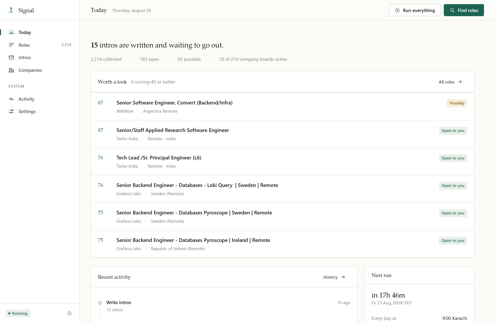
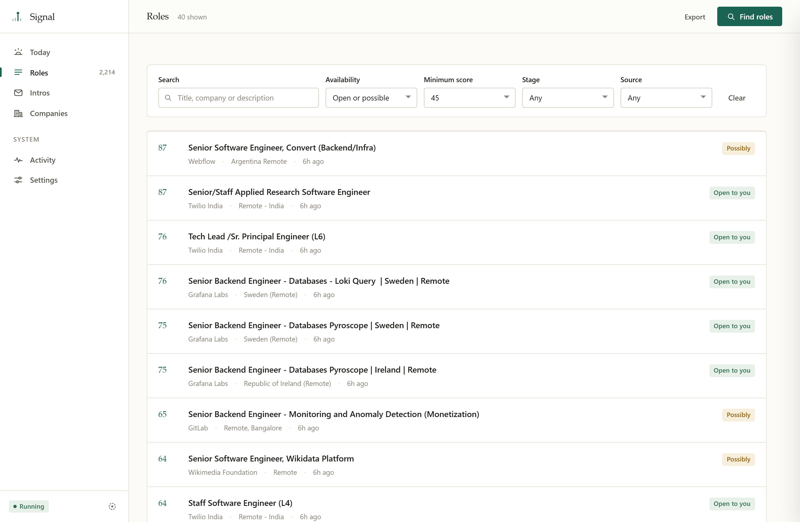
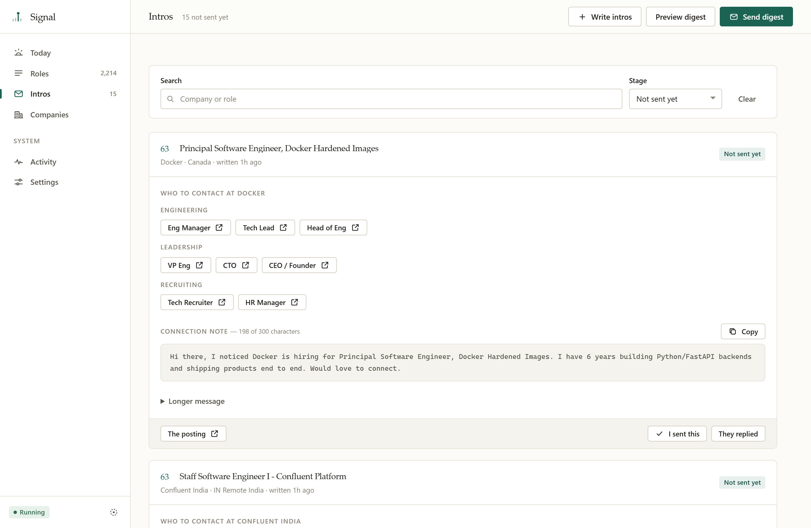
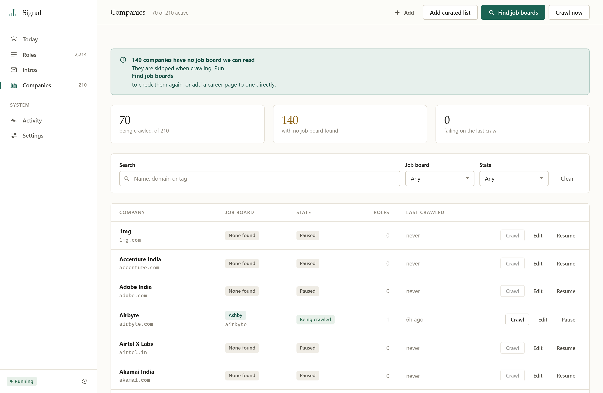
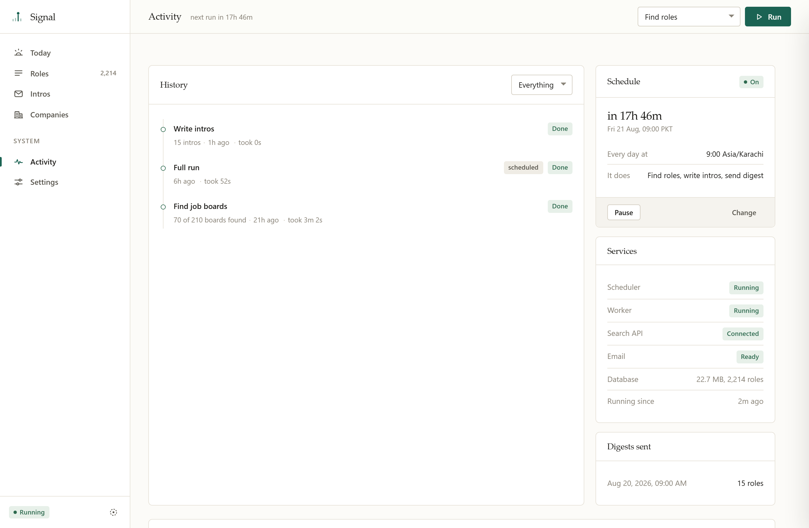
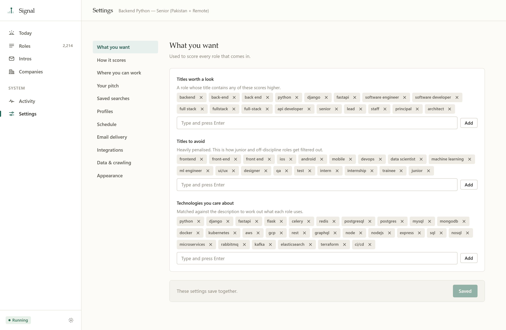
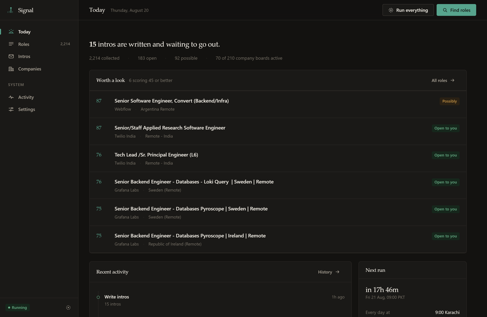

<div align="center">


### Your job search, minus the searching

Signal watches the boards so you don't have to. It collects roles overnight, scores them
against a profile you control, drafts an intro for the ones worth your time, and emails you
a short list every morning.

<br>

[](../../actions)

[](https://fastapi.tiangolo.com)
[](#licence)

<br>



</div>

<br>

## Why it exists

Job boards are a firehose. A senior backend search returns thousands of listings a week,
most of them wrong on stack, seniority, or the fact that you can't legally take them.
Reading that yourself is hours a week of low-value work.

Signal does the reading. Every morning it pulls from public job boards and directly from
company job boards, scores each role 0–100 against your profile, works out whether it's
actually open to someone in your country, and hands you the handful worth a look — each
one with a ready-to-send intro and a LinkedIn search for the person to send it to.

**One command starts everything.** No queue broker, no worker process, no cron entry.

<br>

## What it does

<table>
<tr>
<td width="33%" valign="top">

**Collects**

Public boards (Remotive, RemoteOK, Arbeitnow), optional JSearch for
LinkedIn/Indeed/Glassdoor, and direct crawls of company boards on Greenhouse, Lever and
Ashby.

</td>
<td width="33%" valign="top">

**Scores**

Title, tech overlap, seniority and domain signals, weighted by a profile you edit in the
app. Location fit is worked out separately so a role you can't take never reaches the top.

</td>
<td width="33%" valign="top">

**Writes**

An intro per role, filled from your bio and the tech you and the job have in common,
capped to LinkedIn's 300-character connection note.

</td>
</tr>
<tr>
<td valign="top">

**Runs itself**

A scheduler and a background worker start with the app. Jobs survive a page refresh,
report live progress, and record what they did.

</td>
<td valign="top">

**Explains itself**

Every run keeps its logs, statistics and failure reason. Degraded services show as a
banner — the app never looks healthy while it isn't.

</td>
<td valign="top">

**Configures itself**

Schedule, timezone, credentials, retention and crawl behaviour are all edited in the app
and take effect immediately. No file editing, no restart.

</td>
</tr>
</table>

<br>

## A look around

<table>
<tr>
<td width="50%"><br><sub><b>Roles</b> — every collected listing, scored and filterable, with detail in a side panel.</sub></td>
<td width="50%"><br><sub><b>Intros</b> — the working queue: find someone, copy the message, track the reply.</sub></td>
</tr>
<tr>
<td><br><sub><b>Companies</b> — which employers publish a crawlable board, and which need one found.</sub></td>
<td><br><sub><b>Activity</b> — run history, live progress, streaming logs and service health.</sub></td>
</tr>
<tr>
<td><br><sub><b>Settings</b> — everything configurable, applied without a restart.</sub></td>
<td><br><sub><b>Dark</b> — a real second palette, not inverted greys. Follows the system by default.</sub></td>
</tr>
</table>

<br>

## Getting started

**Requirements** — Python 3.11 or newer. Nothing else; no Node, no database server, no
message broker.

```bash
python -m venv .venv
.venv\Scripts\Activate.ps1          # macOS/Linux: source .venv/bin/activate
pip install -r requirements.txt
python -m uvicorn main:app --host 127.0.0.1 --port 8000
```

Open **http://127.0.0.1:8000**. That single command starts the API, the scheduler and the
background worker together.

Everything after that happens in the browser:

| | |
|---|---|
| **1. Settings → Integrations** | Add a JSearch API key. Optional — the free boards work without one. Use **Test key** before saving. |
| **2. Settings → Email** | Add a Gmail address and app password. **Send test email** verifies it now rather than at 9am. |
| **3. Settings → Your pitch** | Your name, a one-line bio, three achievements. This is what the intros are built from. |
| **4. Companies → Add curated list** | Loads ~210 employers. |
| **5. Companies → Find job boards** | Works out which of them publish through Greenhouse, Lever or Ashby. **Do this** — without it the crawler has nothing to visit. |
| **6. Today → Find roles** | First collection. Watch it run; close the tab if you like, it keeps going. |

> [!TIP]
> Full walkthrough, including how to get each credential, is in **[SETUP.md](SETUP.md)**.
> Working on the code? **[CLAUDE.md](CLAUDE.md)** covers the conventions and the
> traps; **[docs/00-history.md](docs/00-history.md)** explains why things are the
> way they are. **[Profiles and sources](docs/01-profiles-and-sources.md)** and
> **[Database](docs/02-database.md)** cover the two things most likely to change.

<br>

## How it fits together

```
                        ┌──────────────────────────────────┐
   Public boards ──┐    │  Collector                       │
   Company boards ─┼──► │   fetch → score → dedupe → store │
   JSearch API ────┘    └───────────────┬──────────────────┘
                                        │
   ┌────────────────────────────────────▼─────────────────────────────┐
   │  Run engine — one job at a time, progress and logs in SQLite     │
   │  A refresh, a closed tab or a crash never loses a run.           │
   └────────────────────────────────────┬─────────────────────────────┘
                                        │
        ┌───────────────┬───────────────┼───────────────┐
        ▼               ▼               ▼               ▼
    Scoring         Intros          Digest         Web UI
   profile-driven  templated       Gmail SMTP     the only surface
                                                  you need
```

| Layer | Where | What it owns |
|---|---|---|
| HTTP | `api/` | One router per concern. No business logic. |
| App assembly | `main.py` | The application object, lifespan, scheduler, middleware. 185 lines. |
| Domain | `core/` | Collection, scoring, intros, runs, settings, encryption. |
| Sources | `sources/` | One adapter per job board, behind a common interface. |
| Interface | `templates/`, `static/` | Server-rendered pages, vanilla JS. No build step. |

**Design notes worth knowing:**

- **Settings are read at the point of use**, never captured into module constants. That is
  what makes a change apply without a restart — including the timezone, which reschedules
  the live cron job.
- **The scheduler starts unconditionally.** Collection runs daily even when email isn't
  configured; only delivery is skipped, and the gap is surfaced in the UI.
- **One run at a time.** A second start is refused with a clear message rather than
  silently double-spending your API allowance.

<br>

## Configuration

Everything is in **Settings**, stored in the database. Secrets are encrypted at rest and
never returned by any endpoint — the UI only ever sees whether one is set, plus a masked
hint.

| Group | Covers |
|---|---|
| **Schedule** | Run time, timezone, digest size, automation on/off |
| **Email** | Sender, app password, recipient, test send |
| **Integrations** | JSearch key, monthly allowance, Google Sheets |
| **Data** | Retention window, history depth, default filters |
| **Crawling** | Concurrency and timeout for company boards |
| **Appearance** | Product name, theme |

`.env` holds only what must be known before the database opens: `HOST`, `PORT`,
`JOBS_DB_PATH`.

> [!NOTE]
> Encryption protects the **database file** — the thing most likely to end up in a backup
> or a cloud-synced folder. The key sits beside it in `.secret_key`, so it is not a defence
> against someone who can already read the directory. Worth doing, but worth describing
> accurately.

<br>

## Running costs

| | |
|---|---|
| Public boards + company boards | **Free**, no key |
| JSearch (optional) | **Free** tier, 200 requests/month — a hard cap, so you cannot be billed |
| Gmail delivery | **Free** |
| Hosting | **£0** — it runs on your machine |

Four search queries running daily uses about 120 of the 200 monthly requests. Settings
shows the projected cost before you add another.

<br>

## Development

```bash
pip install -r requirements-dev.txt
playwright install chromium

pytest                       # 73 end-to-end tests, ~90s
ruff check .                 # lint
pip-audit                    # dependency vulnerabilities
```

All three run in CI on every push and pull request, against Python 3.11 and
3.12, plus weekly so `pip-audit` reports new advisories against the pinned set.

The suite drives a real browser against a real server. It runs against a throwaway
database and stubs every outbound source, so **it never touches your data and never spends
API quota**.

Coverage is behavioural rather than unit-level: a run survives a hard refresh, a hostile
job description renders inert, a duplicate run is refused, the scheduler starts without
email configured, changing the timezone reschedules the live job.

### The API

With the app running, the full API is documented at
**http://127.0.0.1:8000/docs**, generated from the code itself, with the schema
at `/openapi.json`. Import that URL into Postman for a complete collection.

The cross-origin middleware only blocks non-GET requests carrying a foreign
`Sec-Fetch-Site` header, which browsers always send and command-line tools do
not — so `curl` and Postman work normally.

<br>

## Security

Signal binds to `127.0.0.1` and has **no authentication**. It is a single-user tool for
your own machine. Do not bind `0.0.0.0`.

Within that scope it defends against the things that actually apply:

- Job descriptions are third-party HTML sharing an origin with the API. They are parsed
  inert and rendered as text; feed-supplied URLs are scheme-checked.
- State-changing requests from other origins are refused, so a page you happen to visit
  cannot trigger a run or delete your data.
- Credentials are encrypted at rest and never leave the server.

<br>

## Licence

[MIT](LICENSE).

<br>

---

<div align="center">
<sub>

Built for a real job search. If it saves you an hour a week, it did its job.

</sub>
</div>
